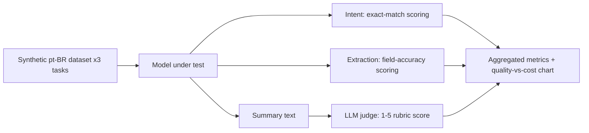

<div align="center">


[](https://github.com/vitormigli/llm-benchmark-ptbr/actions/workflows/ci.yml)


</div>

A reproducible benchmark of Claude model tiers on three real Brazilian-Portuguese
tasks: customer-service intent classification, free-text field extraction, and
conversation summarization (scored by an LLM judge).

## Demo

```bash
make benchmark
```

Reproduces the published results from cached API responses (see `evals/cache/`) —
no API key or spend required to re-run it as published.

## Architecture



## Results

3 models compared (see [`evals/results.md`](evals/results.md) for the full table and
[`evals/quality_vs_cost.png`](evals/quality_vs_cost.png) for the chart):

| Model | Intent accuracy | Extraction field acc. | Summary judge score (1-5) | Cost/1000 calls | p50 latency |
|---|---|---|---|---|---|
| Claude Opus 5 | 100.0% | 84.0% | 5.00 | $2.94 | 2.47s |
| Claude Sonnet 5 | 83.3% | 89.3% | 5.00 | $1.02 | 1.59s |
| Claude Haiku 4.5 | 100.0% | 88.0% | 5.00 | $0.35 | 0.87s |


Haiku 4.5 was Pareto-optimal on this benchmark: highest quality score *and* lowest
cost/latency of the three. The judge gave every model a perfect summarization score
(see Limitations) — the discriminating signal here comes from intent and extraction,
where Sonnet 5 unexpectedly trailed both the cheaper and the pricier model.

## Technical decisions and trade-offs

- **Scope narrowed to the Claude model tier ladder** (Opus 5 / Sonnet 5 / Haiku 4.5)
  instead of the originally planned multi-provider comparison (GPT, Gemini,
  open model via OpenRouter) — this project only had Anthropic API access. The
  methodology (cached, reproducible, cost/latency/quality tracked per call)
  generalizes directly to more providers by adding entries to `MODELS` in
  `src/llm_benchmark/runner.py`.
- **LLM-as-judge uses Claude Opus 5**, which is also one of the models under test —
  a known self-preference risk. Documented as a limitation rather than hidden.
- **Filesystem cache keyed by (model, task, example id)**: `make benchmark` is free
  to re-run after the first time: it reads from `evals/cache/` instead of calling
  the API again, until the cache is deleted or the dataset changes.

## How to run

```bash
cp .env.example .env   # add your ANTHROPIC_API_KEY
docker compose up
```

Or locally with [`uv`](https://docs.astral.sh/uv/):

```bash
uv sync
make test        # unit tests (scoring logic, dataset generation — no API calls)
make benchmark   # run/reproduce the benchmark (uses evals/cache/ when present)
make lint
```

## Limitations and next steps

- Only Claude models compared, not the multi-provider set the wider plan calls for.
- 15 examples per task in this MVP; the scoring and caching design scale to the
  plan's ~50/task without changes.
- The summarization judge and one of the models under test share a provider
  (Anthropic) and, for Opus 5, are the same model — an independent judge model
  would remove that self-preference risk.
- The judge gave all three models a perfect 5/5 on summarization — the rubric isn't
  discriminating enough on this task's difficulty level; harder conversations or a
  stricter rubric would be needed to separate the models on that axis.

## Resumo em português

Benchmark reproduzível comparando os níveis de modelo Claude (Opus 5, Sonnet 5,
Haiku 4.5) em três tarefas reais em português: classificação de intenção de
mensagens de atendimento, extração de campos de texto livre e resumo de conversas
(avaliado por um modelo juiz com rubrica). As respostas ficam em cache, então
`make benchmark` reproduz os resultados publicados sem gastar de novo. O plano
original previa comparar também GPT, Gemini e um modelo aberto via OpenRouter;
o escopo foi reduzido por falta de acesso a essas APIs neste momento.
