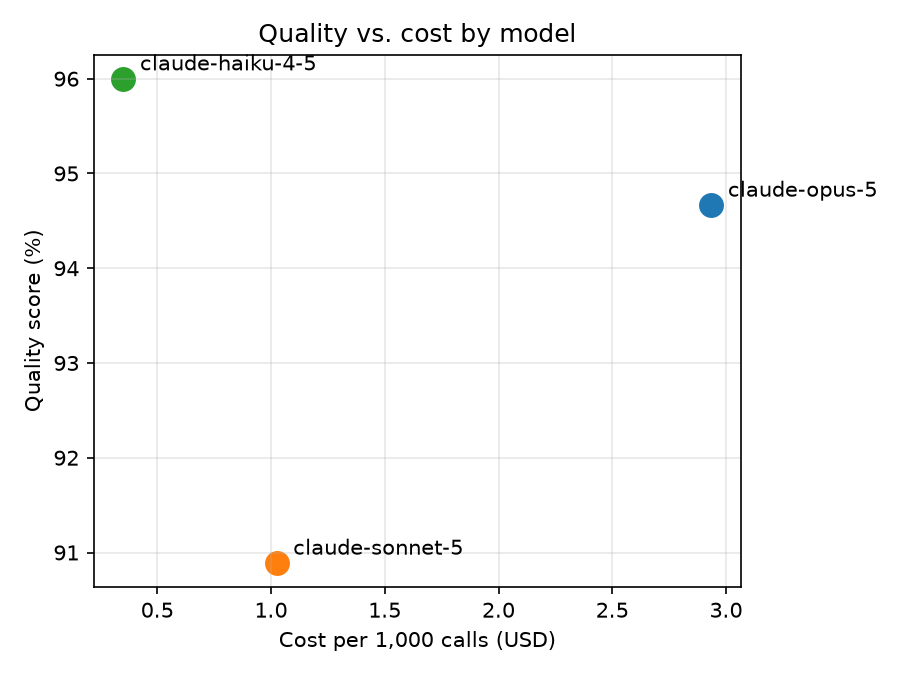

# Benchmark Results

| Model | Intent accuracy | Extraction field acc. | Summary judge score (1-5) | Cost/1000 calls | p50 latency | p95 latency |
|---|---|---|---|---|---|---|
| claude-opus-5 | 100.0% | 84.0% | 5.00 | $2.94 | 2.47s | 3.12s |
| claude-sonnet-5 | 83.3% | 89.3% | 5.00 | $1.02 | 1.59s | 2.20s |
| claude-haiku-4-5 | 100.0% | 88.0% | 5.00 | $0.35 | 0.87s | 1.28s |

